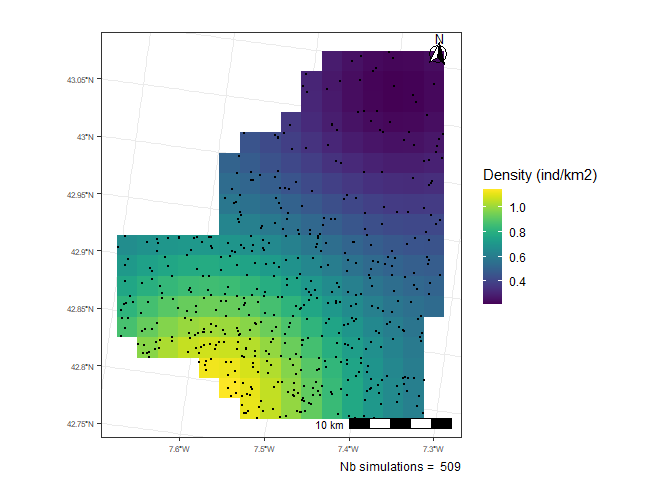
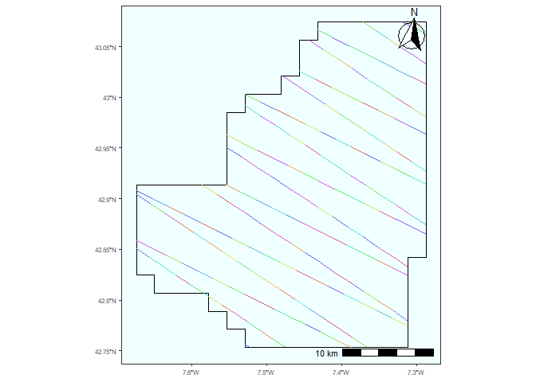

<!-- README.md is generated from README.Rmd. Please edit that file -->

# Intercalibration Des Différents Types De Suivis Aeriens

<!-- badges: start -->

<!-- badges: end -->

This package contains many functions to simulate aerial monitoring data.
From these data simulations, it is possible to obtain abundance and
distribution estimates of species

## Installation

You can install the development version of intercali from
[GitHub](https://github.com/) with:

``` r
# install.packages("devtools")
devtools::install_github("maudqueroue/intercali")
```

## Example

### Extract map with desired densities

This function allows, from a density map `density_obj` (density object
of the `dsims` packages), to provide a map of class `sf` (data.frame).
It allows to recalculate the correct density ratios of the provided map
according to the desired number of individuals in the area `N`.

An example of this function use a dataset of density `dataset_density`
created thanks to the package `dsims`. From this density object, the aim
is to create a map with the correct densities. Here a density
corresponding to 500 individuals in the studied area. Then the function
`plot_map` allows to plot the map.

``` r

# Load the package 
library(intercali)

# Use dataset from the package
data(dataset_density)

# extract map
map <- extract_map(density_obj = dataset_density,
                   N = 500,
                   crs = 2154)

# Plot map
plot_map(map_obj = map)
```


### Simulate individuals with a inhomogenous Poisson point process

From an sf class density map `map_obj` (data.frame), an inohomogene
Poisson point process is used to simulate the presence of individuals in
the studied area. The probability of presence of an individual is
dependent on the density given by the map. The function return a
dataframe, here `ind`, containing the differents individuals simulated
and their geographic coordinates. Then the function `plot_obs` allows to
plot the simulated individuals `ind` on the map with density
information.

``` r

# Simulate individuals
ind <- simulate_ind(map_obj = dataset_map,
                    crs = 2154)
#> Registered S3 method overwritten by 'spatstat.geom':
#>   method     from
#>   print.boxx cli

# Plot indviduals
plot_obs(obs_obj = ind,
         map_obj = map)
```



### Create transect design

The `create_transect` function allows to create transects in the same
way that the `make.design` from the `dssd` package. The
`create_transect` function allows, among other things, to: \* choose
different types of survey design such as zigzag or parallel transects \*
choose the desired transect length (approximately) \* choose the angle
of the transects \* choose the spacing between transects

Here we use as the studied area, a shapefile coming from the `dssd`
package and use the make.region of the `dsims` package. Then the
function `plot_transect` allows to plot the created transects
`transect_obj` on the study area `map_obj`. From this region object,
zigzag transects (`design` = `ezigzag`) with a approximative length of
400000m `line_length` are created in the study area.

``` r
library(dssd)
library(dsims)

# Use of the St Andrews bay map from the dssd package
shapefile.name <- system.file("extdata", "StAndrew.shp", package = "dssd")

# Creation of the object with the make.region function of the dsims package
region <- make.region(region.name = "St Andrews bay",
                      shape = shapefile.name,
                      units = "m")

# Creation of the transects
transects <- create_transect(region_obj = region,
                             crs = 2154,
                             design = "eszigzag",
                             line.length = 400000,
                             design.angle = 30,
                             truncation = 400)

# Plot transects
plot_transects(transect_obj = transects, 
               map_obj = region, 
               crs = 2154)
```


The grid created with `extract_map` does not perfectly match the total
area of the region because it only keeps squares of the same size, so
the edges of the study region are slightly cropped. With the
`create_transect` function, the transects are created on the basis of
the total region `region_obj` and not on the basis of the grid
`map_obj`. Hence there is a need to resize the transects with the
fonction `crop_transect` in order to perfectly fit the density map use
to simulate individuals `map_obj`.

``` r
# Crop transects
cropped_transects <- crop_transect(transect_obj = transects,
                                   map_obj = map)
```

To do distance sampling analyses, it is important to segmentize the
transects in order to (potentially) use covariates on the detection
fonction. Then the function `segmentize_transect` allows to segment the
transects. From the created transect object `transect_obj` and by
choosing the desired length in m `length_m` for the segments, the
function returns a new table with the segments cut and named according
to the transect and the segment, for example, **Sample.Label: 1-2**
indicating the segment 2 of transect 1. The function is not mine it was
found
[here](http://examples.distancesampling.org/dsm-data-formatting/dsm-data-formatting.html).

Thanks to the `ifsegs` argument, the function `plot_transect` allows to
highlight with different colors the different segments in transects.

``` r

# Segmentize transects
segs <- segmentize_transect(transect_obj = cropped_transects,
                            length_m = 2000,
                            to = "LINESTRING")

# Vizualize segments
plot_transects(transect_obj = segs, 
               map_obj = map, 
               crs = 2154,
               ifsegs = TRUE)
```



The `get_monitored_area` function is used to calculate the area of the
study area that is monitored by the transects. The maximum distance
monitored `truncation_m` on the transects is used to calculate the area
of the study area `map_obj` truly followed by the transects
`transect_obj`. In this example, the maximum distance at which an
individual can be observed `truncation_m` is chosen at 400m.

``` r

get_monitored_area(transect_obj = segs,
                   map_obj = map,
                   truncation_m = 400)
#> 260672990 [m^2]
```

### Obtain individuals detected according to the transect design and a detection function

To calculate the probability that an individual could be observe thanks
to the transects simulated, the first thing to do is to calculate
distance between transects/segments and the observation of individuals.
The function `calculate_distance` calculates the nearest
transect/segment `transect_obj` for each simulated individual `obs_obj`.
It returns an array with the name of the closest transect/segment for
each individual and the distance in m and in km between them.

``` r

dist <- calculate_distance(obs_obj = ind, 
                           transect_obj = segs, 
                           crs = 2154)
```

Then, the `detection_function` is use to simulate the probability that a
individual could be observed according to the sample design.

  - The detection function could be an uniform detection function with a
    probability of detection `g_zero` on the whole strip band until the
    maximum distance of observation (in m) `truncation_m`.

  - The detection function could also be a half normal detection
    function for which we can choose the effective strip width (in km)
    `esw_km` i.e. the distance at which there are as much non detected
    individuals before this distance than detected individuals after
    this distance. For the half normal detection function it is also
    possible to choose the proability of detection at 0 meter `g_zero`
    and the maximum distance of observation (in m) `truncation_m`.

<!-- end list -->

``` r
library(ggplot2)
library(cowplot)

detected <- detection(dist_obj = dataset_dist,
                   key = "unif",
                   g_zero = 0.8,
                   truncation_m = 250) 

a <- ggplot(detected, aes(x=distance_m, y=proba)) +
  geom_point(color = "indianred4") +
  xlim(0,500)
  #title("uniform detection")

detected <- detection(dist_obj = dataset_dist,
                   key = "hn",
                   esw_km = 0.16,
                   g_zero = 1,
                   truncation_m = 400)

b <- ggplot(detected, aes(x=distance_m, y=proba)) +
  geom_point(color = "indianred4") +
  xlim(0,500)
  #title("Half normal detection")

plot_grid(a,b)
```


